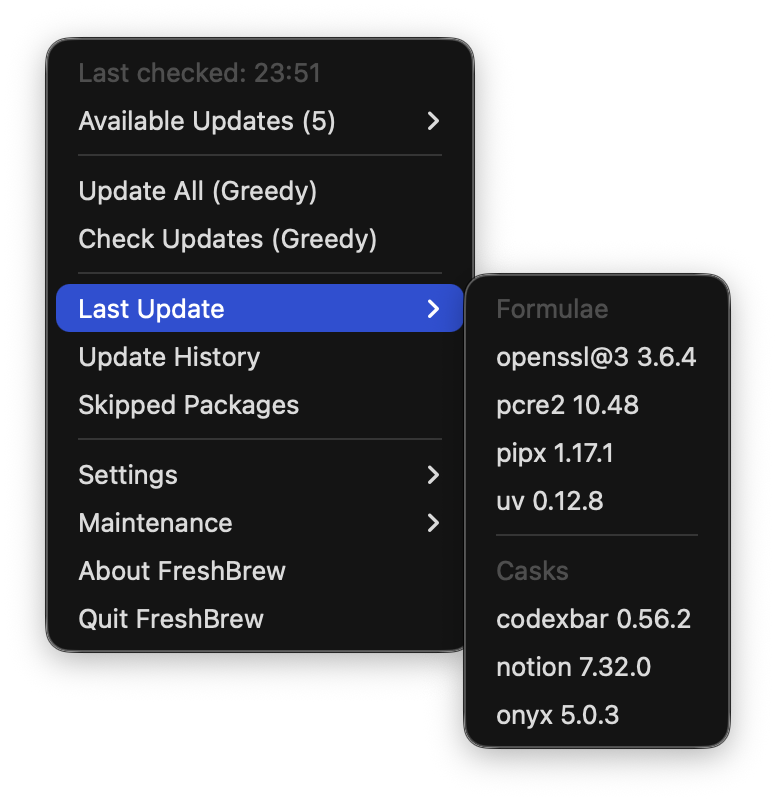
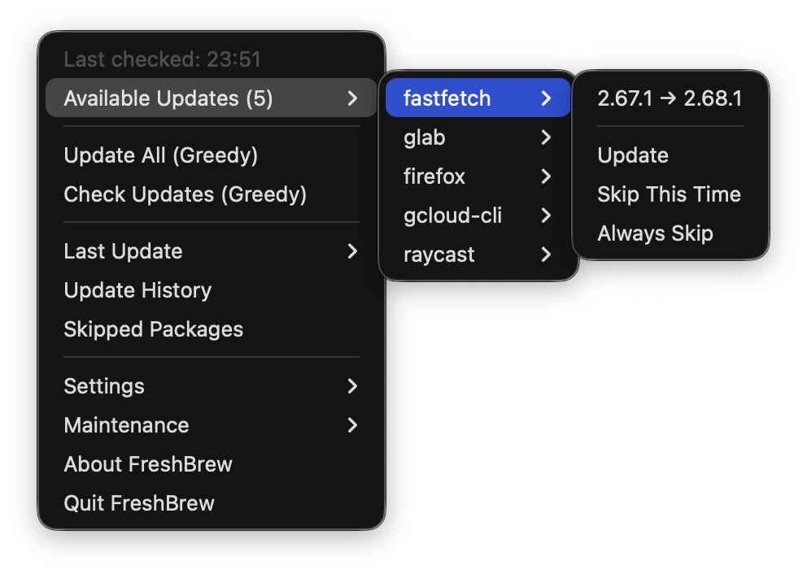
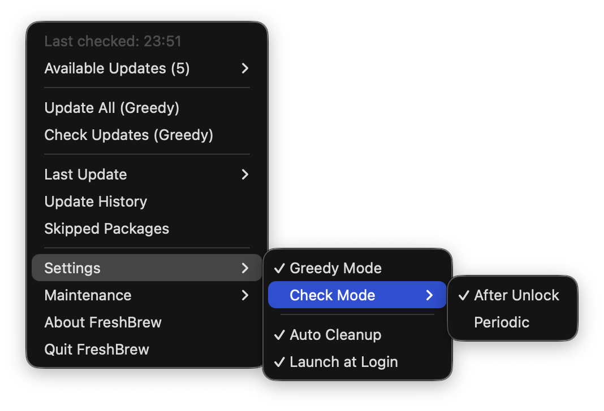
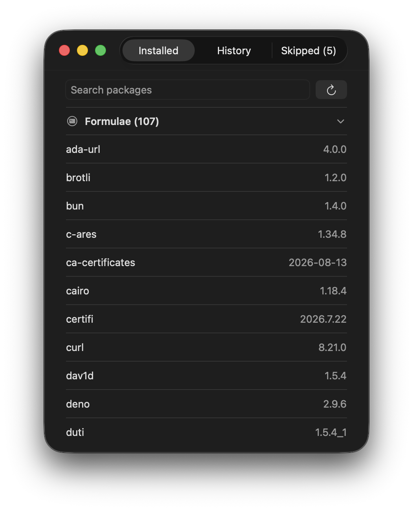
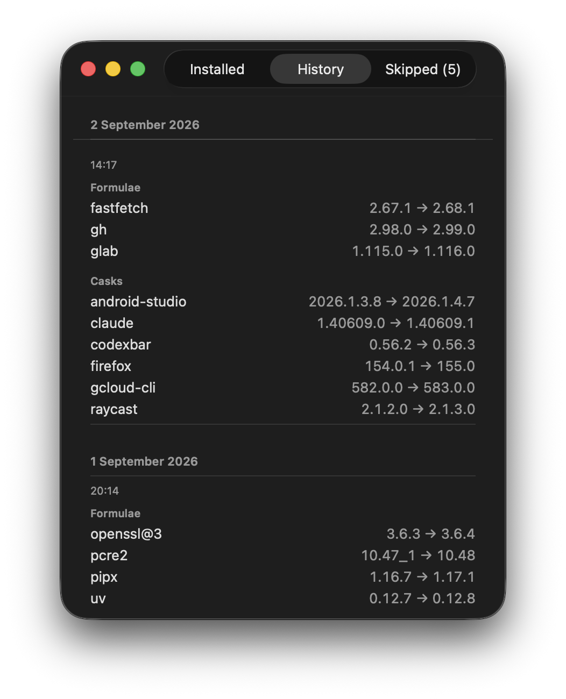
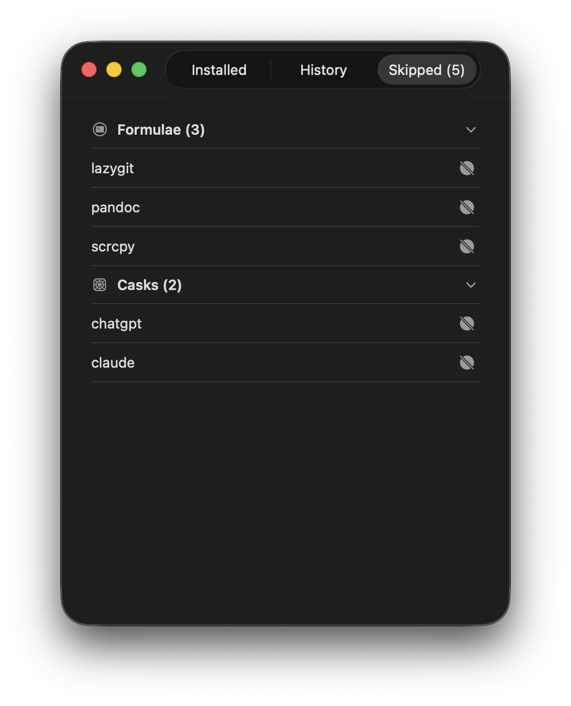

<p align="center">
  
</p>

<h1 align="center">FreshBrew</h1>

<p align="center">A focused macOS menu bar utility for keeping Homebrew formulae and casks up to date.</p>

<p align="center">
  <a href="https://github.com/siannsin/FreshBrew/releases/latest"></a>
  
  
  <a href="https://github.com/siannsin/FreshBrew/actions/workflows/ci.yml"></a>
  <a href="LICENSE"></a>
</p>

<p align="center">
  <a href="#installation">Installation</a>
  · <a href="CHANGELOG.md">Changelog</a>
  · <a href="https://github.com/siannsin/FreshBrew/issues">Report an issue</a>
</p>

<p align="center">
  
</p>

<table align="center">
  <tr>
    <td width="180" align="center"></td>
    <td width="180" align="center"></td>
  </tr>
  <tr>
    <td align="center"><strong>No updates</strong></td>
    <td align="center"><strong>Updates available</strong></td>
  </tr>
</table>

## Why FreshBrew

FreshBrew keeps routine Homebrew maintenance close at hand without becoming a full package manager. Check for updates, control individual packages, and review results directly from the menu bar.

## Highlights

### Work from the menu bar

<table>
  <tr>
    <th width="50%" align="left">Control individual packages</th>
    <th width="50%" align="left">Choose how FreshBrew checks</th>
  </tr>
  <tr>
    <td>Update a package, skip it for this session, or keep it excluded.</td>
    <td>Use Greedy Mode and choose between after-unlock or periodic checks.</td>
  </tr>
  <tr>
    <td></td>
    <td></td>
  </tr>
</table>

### Browse and review packages

<table>
  <tr>
    <th width="33%" align="left">Installed Packages</th>
    <th width="33%" align="left">Update History</th>
    <th width="33%" align="left">Skipped Packages</th>
  </tr>
  <tr>
    <td>Search installed formulae and casks, review their versions, and manage exclusions.</td>
    <td>Review completed updates, including successful work from partial batches.</td>
    <td>See persistent exclusions and return packages to future checks.</td>
  </tr>
  <tr>
    <td></td>
    <td></td>
    <td></td>
  </tr>
</table>

## Features

### Checking and updating

- Check and update Homebrew formulae and casks from the menu bar.
- Enable Greedy Mode for casks that use Homebrew's `--greedy` behavior.
- Update all available packages or handle them individually.
- Detect Homebrew casks that require a forced reinstall and verify results afterward.

### Automation

- Check automatically after unlock or on a configurable periodic interval.
- Receive update notifications with an **Update All** action.
- Check GitHub Releases for newer FreshBrew versions.
- Launch FreshBrew when you sign in.

### Package control and recovery

- Browse installed formulae and casks, search by name, and review installed versions.
- Skip packages once or keep them in a persistent skip list.
- Follow package homepage links from available updates and package lists.
- Preserve completed packages in history when only part of a batch succeeds.
- Retry Homebrew operations that require administrator access.
- Retain detailed Homebrew error logs for seven days without storing passwords.

### Cleanup

- Run optional cleanup after a failure-free update.
- Start standard or deep Homebrew cleanup manually from the menu.
- Report reclaimed disk space when cleanup frees storage.

## Requirements

- Apple Silicon or Intel Mac
- macOS 14 or later
- [Homebrew](https://brew.sh/) installed

## Installation

Install with Homebrew:

```bash
brew install --cask siannsin/tap/freshbrew
```

Upgrade later with:

```bash
brew upgrade --cask freshbrew
```

Alternatively, download `FreshBrew-<version>-universal.dmg` from the
[latest GitHub release](https://github.com/siannsin/FreshBrew/releases/latest),
open it, and drag **FreshBrew** into **Applications**.

FreshBrew releases are currently ad-hoc signed and are not Apple-notarized. macOS may block the first launch because the developer cannot be verified. After attempting to open FreshBrew:

1. Open **System Settings → Privacy & Security**.
2. Scroll to **Security** and click **Open Anyway** for FreshBrew.
3. Confirm **Open**.

See [Apple's instructions for opening an app from an unknown developer](https://support.apple.com/guide/mac-help/open-a-mac-app-from-an-unknown-developer-mh40616/mac).

To verify the downloaded DMG against its matching release checksum:

```bash
shasum -a 256 -c FreshBrew-<version>-universal.dmg.sha256
```

## Getting Started

FreshBrew is a menu bar app, so it does not open a normal app window or appear in the Dock.

1. Click the FreshBrew icon in the menu bar.
2. Select **Check Updates**.
3. Review **Available Updates**, update individual packages, or select **Update All**.
4. Open **Update History** or **Skipped Packages**, then switch between the Installed, History, and Skipped tabs.

FreshBrew never installs Homebrew package updates merely because a check found them. Updating remains a separate user action.

## Settings

| Setting | Behavior |
| --- | --- |
| **Greedy Mode** | Includes casks that auto-update or otherwise require Homebrew's `--greedy` behavior. Off by default. |
| **Check Mode** | Runs checks after unlock or periodically. After-unlock mode observes a four-hour threshold, then waits one minute before checking. |
| **Check Interval** | Selects the interval used by Periodic mode. |
| **Auto Cleanup** | Runs cleanup after a failure-free update that completed at least one package. Off by default. |
| **Launch at Login** | Starts FreshBrew when you sign in. |
| **Check automatically** | Checks quietly once per day for newer FreshBrew releases. Available in **About FreshBrew**. |

Changing Greedy Mode clears the current package results so the next check uses the newly selected mode consistently.

## Permissions and Privacy

FreshBrew may request:

| Permission | Why it is used |
| --- | --- |
| **Notifications** | Reports available updates and update results. |
| **App Management** | Allows Homebrew to replace applications installed in `/Applications`. |
| **Administrator password** | Continues a Homebrew installer that requires elevated access. The password is not retained. |

FreshBrew does not include analytics or user tracking. Homebrew commands use the network as required, and the app update checker contacts the GitHub Releases API.

Detailed Homebrew failures are retained locally for seven days at:

```text
~/Library/Application Support/FreshBrew/homebrew-errors.json
```

## Build from Source

Clone the repository and build a universal Release app:

```bash
git clone https://github.com/siannsin/FreshBrew.git
cd FreshBrew

xcodebuild build \
  -project FreshBrew.xcodeproj \
  -scheme FreshBrew \
  -configuration Release \
  -destination 'generic/platform=macOS' \
  -derivedDataPath /private/tmp/freshbrew-build \
  ARCHS="arm64 x86_64" \
  ONLY_ACTIVE_ARCH=NO
```

Run the built app:

```bash
open /private/tmp/freshbrew-build/Build/Products/Release/FreshBrew.app
```

You can also open `FreshBrew.xcodeproj` in Xcode, select **My Mac**, configure your own Personal Team under **Signing & Capabilities**, and run with <kbd>⌘R</kbd>.

Run the test suite without code signing:

```bash
xcodebuild test \
  -project FreshBrew.xcodeproj \
  -scheme FreshBrew \
  -destination 'platform=macOS' \
  -derivedDataPath /private/tmp/freshbrew-derived-data \
  CODE_SIGNING_ALLOWED=NO
```

## Troubleshooting

### FreshBrew does not appear in the Dock

This is expected. FreshBrew runs only in the menu bar.

### macOS blocks FreshBrew on first launch

Follow the **Open Anyway** steps in [Installation](#installation). Public releases are not currently notarized by Apple.

### Homebrew checks or updates fail

First confirm Homebrew itself works:

```bash
brew update
brew outdated --verbose
```

FreshBrew keeps detailed failures for seven days at the log path listed under [Permissions and Privacy](#permissions-and-privacy).

### Notifications do not appear

Open **System Settings → Notifications → FreshBrew** and make sure notifications are allowed. Focus modes may silence or defer banners.

## Support

Report bugs and feature requests through [GitHub Issues](https://github.com/siannsin/FreshBrew/issues).

## Attribution

FreshBrew is an independently implemented project inspired by [TopOff](https://github.com/ihazgithub/TopOff) by Thomas Haslam.

## License

FreshBrew is available under the [MIT License](LICENSE).
